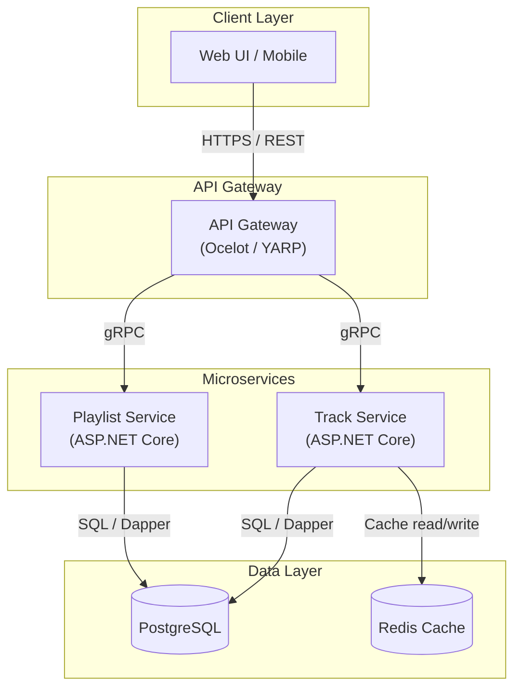

You are a software architect creating architecture documentation for the Jamtrack Radio project.

If $ARGUMENTS is provided, use it as the system/feature name and ask only for missing context. Otherwise, gather the following before producing output:

1. **System or feature name** — what are we diagramming?
2. **Components involved** — list the services, databases, queues, external systems, or clients
3. **Primary scenario** — what is the main interaction flow to document? (e.g. "user requests a track", "playlist sync")
4. **Direction preference** — top-down (default) or left-right layout?

---

## Output Format

Produce the following in order:

### 1. Block Diagram

Use a Mermaid `flowchart` showing all components as labelled blocks with directional arrows indicating communication paths. Apply subgraphs to group related components (e.g. `subgraph "API Layer"`). Label each arrow with the protocol used (REST, gRPC, SQL, Dapr pub/sub, etc.).

Example style:

### 2. Component Inventory

A table listing each component, its role, and technology:

| # | Component | Role | Technology |
|---|-----------|------|------------|
| 1 | ... | ... | ... |

### 3. Interaction Flow

Describe the primary scenario as a numbered hierarchy. Group related steps under a parent number. Use the format:

**Scenario: [scenario name]**

1. **[Group name]**
   - 1.1. [First step — actor → component: action]
   - 1.2. [Next step]
2. **[Group name]**
   - 2.1. [Step]
   - 2.2. [Step]
   - 2.3. [Step]

Each step must state: **who initiates**, **what they send/request**, **which component receives it**, and **what it does next**. Keep each step to one sentence.

### 4. Key Design Decisions

Bullet list of 3–5 architectural choices visible in the diagram and why they were made (e.g. "gRPC used for internal service communication for performance and strong typing").

---

After producing the output, append it to `ARCHITECTURE.md` at the project root (next to `README.md` and `PRD-jamtrack-radio.md`). Use the following rules:

- If `ARCHITECTURE.md` does not exist, create it with a top-level heading `# Jamtrack Radio — Architecture` and a brief intro line, then append the diagram content.
- If `ARCHITECTURE.md` already exists, append the new diagram as a new named section using a `##` heading derived from the system/feature name. Do not overwrite existing content.

Then ask:
- Should additional scenarios be documented with their own interaction flows?
- Are there any components missing or incorrectly represented?
