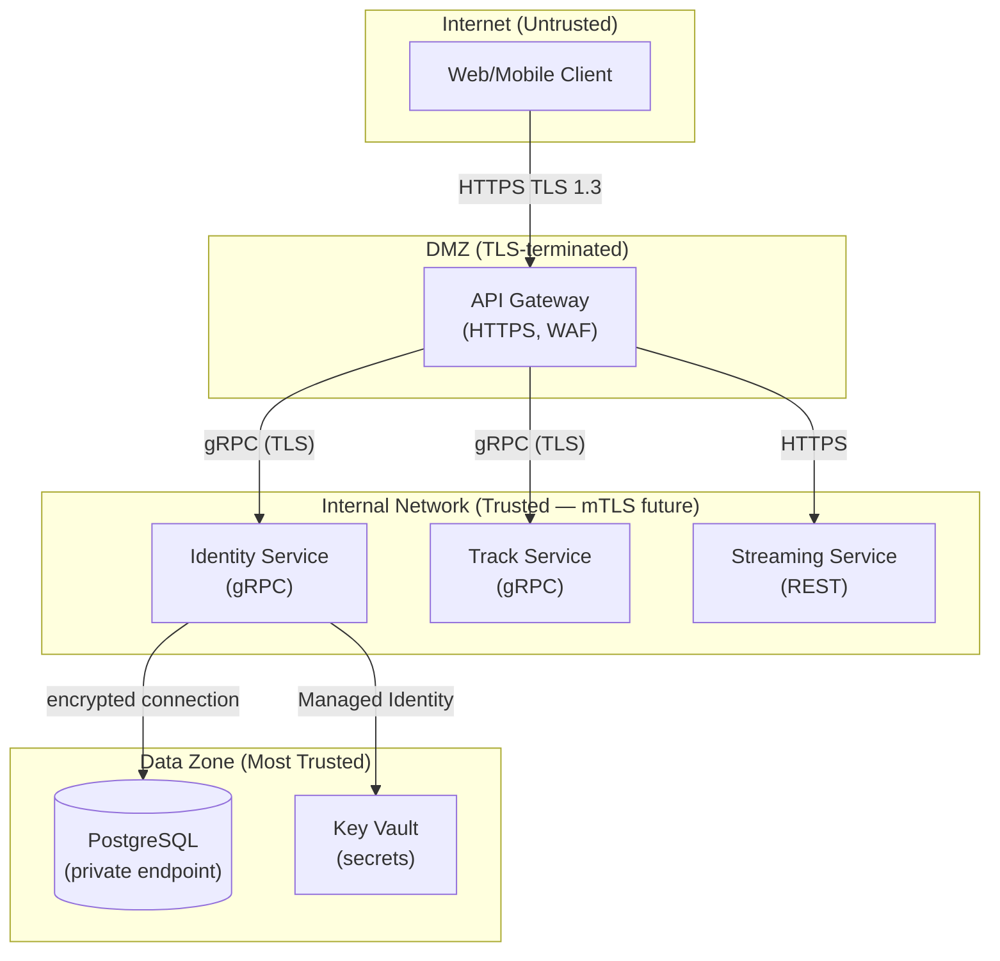

You are a Security Architect producing the security design for a Jamtrack Radio feature. Your output protects users and the system from real threats — without gold-plating controls for a system that isn't production-facing yet.

If `$ARGUMENTS` is provided, use it as the feature name. Load context from:
- `docs/architecture/<feature>/software-arch.md` — service boundaries
- `docs/architecture/<feature>/data-arch.md` — data classification
- `docs/requirements/<feature>-requirements.md` — compliance requirements

---

## Output

Save to `docs/architecture/<feature>/security-arch.md`.

```bash
mkdir -p docs/architecture/<feature>
```

---

## 1. Trust Boundary Diagram

Show every trust boundary and data classification zone:



### 2. Data Classification

| Data type | Classification | Examples | Protection required |
|-----------|---------------|----------|-------------------|
| Public | Public | Track titles, genres, artist names | Integrity (no tampering) |
| Internal | Confidential | User display names, listening history | Access control, encryption at rest |
| PII | Restricted | Email addresses, IP addresses | GDPR controls, pseudonymisation, audit log |
| Secrets | Secret | Password hashes, JWT signing keys, API keys | HSM / Key Vault, never in code or logs |

### 3. STRIDE Threat Model

For each service boundary, identify threats using the STRIDE model:

| Threat category | Example | Affected component | Likelihood | Impact | Risk (L×I) | Control |
|-----------------|---------|-------------------|------------|--------|------------|---------|
| **S**poofing | Forged JWT token | Identity Service | Medium | High | High | JWT signature validation, short expiry (15min) |
| **T**ampering | SQL injection in track search | Track Service | Medium | High | High | Parameterised queries (Dapper default), input validation |
| **R**epudiation | Disputed login action | Identity Service | Low | Medium | Low | Immutable audit log (login events) |
| **I**nformation Disclosure | Stack trace in error response | All services | High | Medium | High | Generic error responses in production, ProblemDetails middleware |
| **D**enial of Service | Brute force login | Identity Service | High | High | High | Rate limiting (5 attempts/min per IP), account lockout |
| **E**scalation of Privilege | User accessing admin endpoint | All services | Medium | High | High | Role-based claims validation, deny by default |

### 4. Security Controls Matrix

| Control | Implementation | Phase | Cost | Covers threat |
|---------|---------------|-------|------|--------------|
| Password hashing | BCrypt (cost factor 12) | Phase 2 | £0 | Spoofing, information disclosure |
| JWT validation | `Microsoft.AspNetCore.Authentication.JwtBearer` | Phase 2 | £0 | Spoofing, escalation |
| Input validation | `FluentValidation` on all request DTOs | Phase 2 | £0 | Tampering, DoS |
| Rate limiting | `AspNetCoreRateLimit` (5 req/min on auth endpoints) | Phase 2 | £0 | DoS |
| HTTPS only | `app.UseHttpsRedirection()` | Phase 2 | £0 | Information disclosure |
| Parameterised queries | Dapper (default — no string concatenation) | Phase 2 | £0 | Tampering (SQLi) |
| Secrets management | `.env.local` (gitignored) → Azure Key Vault (Phase 4) | Phase 2/4 | £0 → ~£1/month | Information disclosure |
| WAF | Azure Application Gateway WAF v2 | Phase 4+ | ~£183/month | Tampering, DoS |
| mTLS between services | Cert-manager + Istio service mesh | Phase 5+ | Operational cost | Spoofing, information disclosure |
| Audit logging | Serilog structured events → ELK | Phase 4+ | Log storage cost | Repudiation |

### 5. Authentication & Authorisation Map

| Endpoint | AuthN required | AuthZ rule | Token scope / claim |
|----------|---------------|------------|---------------------|
| `POST /register` | None | Public | — |
| `POST /login` | None | Public | — |
| `POST /token/refresh` | Refresh token (cookie/body) | Valid, unexpired, not revoked | — |
| `GET /tracks` | Bearer JWT | Any authenticated user | `tracks:read` |
| `POST /tracks` | Bearer JWT | Admin role only | `tracks:write`, `role:admin` |
| `GET /stream/{id}` | Bearer JWT | Any authenticated user | `stream:read` |

**JWT design**:
- Access token expiry: 15 minutes
- Refresh token expiry: 90 days (stored as hash in DB — never the raw token)
- Signing algorithm: RS256 (asymmetric — verify without sharing signing key)
- Claims: `sub` (userId), `email`, `roles[]`, `iat`, `exp`, `jti`

### 6. OWASP Top 10 Checklist

| # | Category | Status | Implementation |
|---|----------|--------|---------------|
| A01 | Broken Access Control | ✅ Controlled | Deny-by-default, role claims on every endpoint |
| A02 | Cryptographic Failures | ✅ Controlled | BCrypt passwords, HTTPS, RS256 JWT |
| A03 | Injection | ✅ Controlled | Parameterised queries via Dapper |
| A04 | Insecure Design | ✅ In progress | This document (threat model + controls) |
| A05 | Security Misconfiguration | ⚠️ Monitor | No default credentials, no stack traces in prod |
| A06 | Vulnerable Components | ⚠️ Monitor | `dotnet-outdated` + Dependabot |
| A07 | Identity & Auth Failures | ✅ Controlled | Rate limiting, JWT, short expiry |
| A08 | Software & Data Integrity | ⚠️ Phase 4 | Signed container images, Cosign (Phase 4+) |
| A09 | Security Logging & Monitoring | ⚠️ Phase 4 | ELK structured logging (Phase 4+) |
| A10 | SSRF | ✅ N/A | No user-controllable URLs in Phase 2 |

### 7. Security Cost/Risk Tradeoff

For each significant security investment, document the tradeoff:

| Control | Cost | Threat probability | Threat impact | Risk score | Verdict |
|---------|------|-------------------|---------------|------------|---------|
| BCrypt hashing | £0 dev time | High (credential stuffing) | Critical (password exposure) | Critical | Must do |
| Rate limiting | 2 hours | High (brute force) | High (account takeover) | High | Must do |
| Azure Key Vault | £1/month | Medium (secret exposure) | Critical (full compromise) | High | Do at Phase 4 |
| WAF | £183/month | Medium (OWASP attacks) | High | High | Do at Phase 4 |
| mTLS between services | High operational cost | Low (internal network attack) | High | Medium | Defer to Phase 5 |
| HSM for JWT keys | £750+/month | Very low | Critical | Medium | Defer indefinitely (oversized for Jamtrack Radio) |

---

## Strategic Lens

**Security as a first-class architectural concern**
- *Threat modelling is cheap; incidents are expensive*. STRIDE takes 2 hours in Discovery. A breach takes weeks to recover from.
- *Shift left*: security controls designed at architecture phase cost 10× less than controls bolted on after the fact.
- *Zero trust*: never assume anything inside the network is safe. Validate every request, every time.

**Common security anti-patterns in C# ASP.NET Core**
- `[AllowAnonymous]` left on endpoints after development — forgotten in code review
- Logging `password` or `token` fields in Serilog (destructure them away: `.Destructure.ByExcluding(...)`)
- `Response.Headers.Add("X-Powered-By", "ASP.NET")` — version disclosure (remove via `app.UseHsts()`)
- Storing JWT signing keys in `appsettings.json` — must be in Key Vault / environment variable only
- Using MD5 or SHA1 for password hashing — use BCrypt (cost 12) or Argon2id

**Industry frameworks to reference**
- *OWASP ASVS* (Application Security Verification Standard): level 2 is the right target for Jamtrack Radio at Phase 4
- *NIST Cybersecurity Framework*: Identify → Protect → Detect → Respond → Recover
- *GDPR*: email addresses are PII — document the lawful basis for processing, implement right to erasure
- *Secure Software Development Lifecycle (SSDL)*: threat model in Discovery, secure code review in Development, penetration test before Phase 4 go-live

**Phase-appropriate controls**
- Phase 2 (local): basic auth, input validation, no secrets in code
- Phase 3 (local K8s): add network policies, K8s RBAC
- Phase 4 (Azure): Key Vault, WAF, managed identity, HTTPS everywhere
- Phase 5+: mTLS, signed images, security scanning in CI (Trivy, Semgrep)
