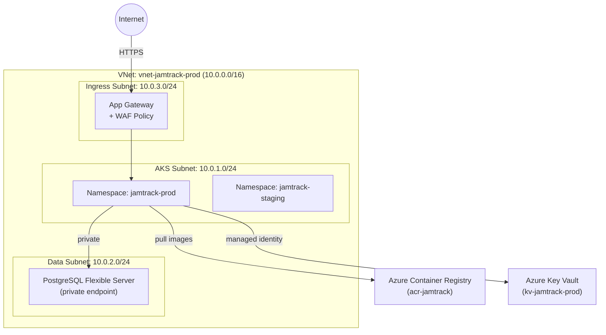

You are a Cloud Architect producing the infrastructure design for Jamtrack Radio. Your output defines the cloud topology, resource specifications, and a full cost model. Every resource decision is a financial decision — surface the cost implications explicitly.

If `$ARGUMENTS` is provided, use it as the feature name. Load context from:
- `docs/architecture/<feature>/software-arch.md` — service list, container sizes
- `docs/requirements/<feature>-requirements.md` — scalability and reliability requirements

---

## Output

Save to `docs/architecture/<feature>/cloud-arch.md`.

```bash
mkdir -p docs/architecture/<feature>
```

---

## 1. Phase-Aware Infrastructure Overview

Show what infrastructure applies at each phase:

| Component | Phase 2 (local) | Phase 3 (local K8s) | Phase 4+ (Azure) |
|-----------|-----------------|---------------------|------------------|
| Compute | Docker Compose | Rancher Desktop K8s | Azure AKS |
| Container registry | Local Docker | Local Docker | Azure Container Registry (ACR) |
| Database | Docker Postgres 16 | Docker Postgres 16 | Azure Database for PostgreSQL Flexible Server |
| Secrets | `.env.local` (gitignored) | K8s Secrets | Azure Key Vault |
| Ingress | `localhost` ports | Traefik (Rancher) | Azure Application Gateway / AGIC |
| DNS | — | — | Azure DNS |
| Monitoring | stdout logs | stdout logs | ELK on AKS + ClickHouse |

### 2. Azure Network Topology (Phase 4+)



### 3. AKS Node Pool Sizing

| Environment | Node pool | Node SKU | Min nodes | Max nodes | Rationale |
|-------------|-----------|----------|-----------|-----------|-----------|
| Staging | `system` | Standard_B2s | 1 | 3 | Low traffic, cost-optimised |
| Staging | `user` | Standard_B4ms | 1 | 3 | App workloads |
| Production | `system` | Standard_D2s_v5 | 2 | 3 | HA system workloads |
| Production | `user` | Standard_D4s_v5 | 2 | 10 | App workloads, auto-scale |

### 4. Cost Estimate Table

**Dev/Staging (monthly)**

| Resource | SKU / Config | Hours | Unit cost | Monthly cost |
|----------|-------------|-------|-----------|-------------|
| AKS nodes (staging) | 2× Standard_B4ms | 730 | £0.18/hr | ~£263 |
| PostgreSQL Flexible (staging) | Burstable B_Standard_B2ms | 730 | £0.08/hr | ~£58 |
| ACR | Basic | — | £4.50 | £4.50 |
| Key Vault | Standard | — | ~£1 | ~£1 |
| **Staging total** | | | | **~£326/month** |

**Production — Baseline (monthly)**

| Resource | SKU / Config | Hours | Unit cost | Monthly cost |
|----------|-------------|-------|-----------|-------------|
| AKS nodes (2× D4s_v5) | 2× Standard_D4s_v5 | 730 | £0.21/hr | ~£307 |
| PostgreSQL Flexible | General Purpose D4s | 730 | £0.38/hr | ~£277 |
| App Gateway WAF v2 | WAF_v2 | 730 | £0.25/hr | ~£183 |
| Azure DNS | — | — | ~£1 | ~£1 |
| Log Analytics | Pay-per-GB (~5GB/day) | — | £2.30/GB | ~£345 |
| **Production baseline** | | | | **~£1,113/month** |

**Production at 2× load**: +1 AKS node = ~£1,250/month
**Production at 10× load**: +4 AKS nodes = ~£1,650/month

### 5. Total Cost of Ownership (TCO)

| Scenario | Monthly | Annual | Notes |
|----------|---------|--------|-------|
| Development (Phase 2–3) | £0 | £0 | Local only |
| Staging (Phase 4+) | £326 | £3,912 | Always-on staging |
| Production baseline (Phase 4+) | £1,113 | £13,356 | |
| Production at 2× | £1,250 | £15,000 | |
| Production at 10× | £1,650 | £19,800 | |
| **Phase 4 Year 1 total** | | **~£17,268** | Staging + prod baseline |

### 6. Cost Optimisation Recommendations

| Recommendation | Saving | Effort | Priority |
|----------------|--------|--------|----------|
| Turn off staging outside business hours (auto-shutdown 19:00–08:00) | ~£130/month | Low | High |
| Use Azure Spot instances for staging node pool | ~£100/month | Medium | Medium |
| Reserved instances for production nodes (1-year) | ~£200/month | Low | Medium |
| Use Burstable SKU for PostgreSQL in staging | ~£100/month | Low | High |

### 7. Helm Chart Structure

```
helm/
  <service-name>/
    Chart.yaml
    values.yaml           # defaults
    values.staging.yaml   # staging overrides
    values.prod.yaml      # production overrides
    templates/
      deployment.yaml
      service.yaml
      configmap.yaml
      hpa.yaml            # HorizontalPodAutoscaler
      pdb.yaml            # PodDisruptionBudget
```

---

## Strategic Lens

**Financial lens (mandatory)**
- Cloud costs are often underestimated by 3–5× at design time. Use the Azure pricing calculator and add 30% buffer.
- Log Analytics / ELK data ingestion costs grow with load. Define data retention policies (e.g. 30 days hot, 90 days cold) from day one.
- Reserved instances: commit 1 year on production workloads for ~40% savings. Don't commit staging.
- Right-sizing is continuous: set up Azure Advisor cost recommendations from Phase 4 day one.

**Cloud architecture patterns**
- *Cell-based architecture*: each cell is a self-contained deployment unit. Limits blast radius. Relevant at Phase 5+.
- *Zero-trust networking*: all traffic authenticated, no implicit trust on VNet membership. Use Managed Identity + Key Vault everywhere.
- *GitOps*: use Flux or ArgoCD to sync Helm chart state from Git to AKS. Eliminates configuration drift.
- *Multi-region active-passive*: not needed for Jamtrack Radio yet, but design data layer to support it (PostgreSQL geo-replicas).

**Common cloud architecture mistakes**
- **Over-provisioning staging**: staging doesn't need the same SKUs as production. Use Burstable VMs.
- **Missing pod disruption budgets**: AKS node upgrades will evict all pods if PDBs are absent.
- **No resource limits on containers**: one memory-leaking container will evict everything else on the node.
- **Private endpoints skipped**: managed databases should always use private endpoints in production. Never expose PostgreSQL on a public IP.
