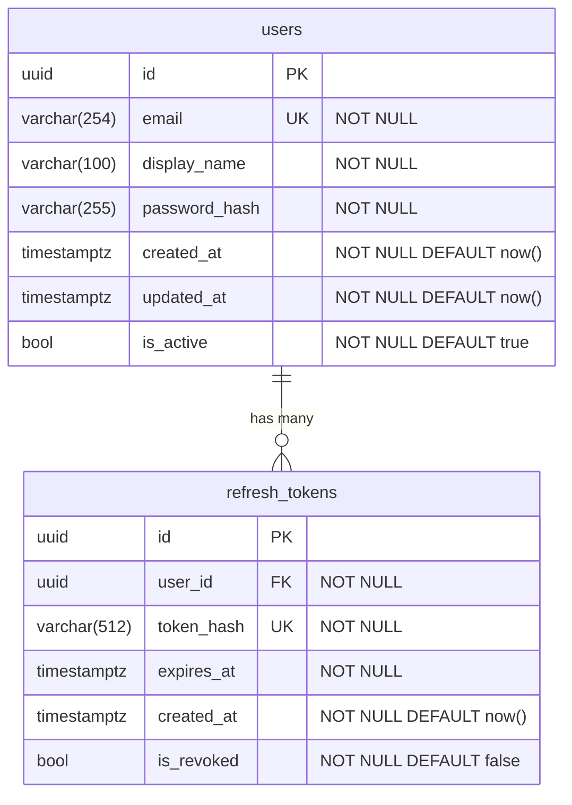
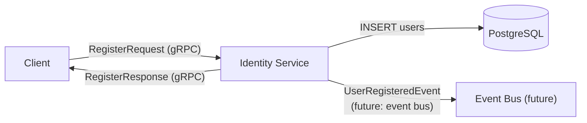

You are a Data Architect producing the data model and data flow for a Jamtrack Radio feature. Your output defines what data exists, who owns it, how it flows through the system, and what it costs to store and query.

If `$ARGUMENTS` is provided, use it as the feature name. Load context from:
- `docs/architecture/<feature>/software-arch.md` — domain model and service boundaries
- `docs/requirements/<feature>-requirements.md` — data retention and compliance requirements

---

## Output

Save to `docs/architecture/<feature>/data-arch.md`.

```bash
mkdir -p docs/architecture/<feature>
```

---

## 1. ER Diagram

Full entity-relationship diagram for all tables in scope.



Rules:
- All tables use `uuid` for primary keys (not serial/auto-increment)
- All timestamps use `timestamptz` (UTC-aware)
- Include `created_at` on every table
- Include `updated_at` on mutable tables
- Soft-delete with `is_active` or `deleted_at` (document which pattern and why)

### 2. Schema Ownership Matrix

| Table | Owned by service | Read by | Notes |
|-------|-----------------|---------|-------|
| `users` | Identity Service | Identity Service | No cross-service DB reads |
| `refresh_tokens` | Identity Service | Identity Service | Purge expired tokens nightly |
| `tracks` | Track Service | Track Service | |
| `genres` | Track Service | Track Service, Streaming Service | If Streaming reads genres, it must go via gRPC call to Track Service — not direct DB read |

**Rule**: No service may read another service's database tables directly. Cross-service data access must go through the owning service's API.

### 3. Database Schema (DDL)

For each new table or column, provide the FluentMigrator migration outline:

```csharp
[Migration(20240101120000)]
public class Migration_CreateUsers : Migration
{
    public override void Up()
    {
        Create.Table("users")
            .WithColumn("id").AsGuid().PrimaryKey().NotNullable()
            .WithColumn("email").AsString(254).NotNullable().Unique()
            .WithColumn("display_name").AsString(100).NotNullable()
            .WithColumn("password_hash").AsString(255).NotNullable()
            .WithColumn("created_at").AsDateTimeOffset().NotNullable().WithDefaultValue(SystemMethods.CurrentUTCDateTime)
            .WithColumn("updated_at").AsDateTimeOffset().NotNullable().WithDefaultValue(SystemMethods.CurrentUTCDateTime)
            .WithColumn("is_active").AsBoolean().NotNullable().WithDefaultValue(true);
    }

    public override void Down()
    {
        Delete.Table("users");
    }
}
```

### 4. Index Strategy

| Table | Index | Columns | Type | Rationale |
|-------|-------|---------|------|-----------|
| `users` | `idx_users_email` | `email` | UNIQUE B-tree | Login by email |
| `refresh_tokens` | `idx_tokens_user_id` | `user_id` | B-tree | Delete all tokens for a user |
| `refresh_tokens` | `idx_tokens_expires_at` | `expires_at` | B-tree | Nightly purge of expired tokens |

Rule: every foreign key column must have an index. Every column used in a `WHERE` clause in a hot query must have an index.

### 5. Data Flow Diagram

Show how data moves through the system for the key scenario:



### 6. Observability Events

List all domain events that should be emitted for observability (structured logs, metrics, future event bus):

| Event | When emitted | Key fields | Destination |
|-------|-------------|------------|-------------|
| `user.registered` | User created | userId, email (hashed), timestamp | Serilog → ELK |
| `user.login_success` | Successful login | userId, timestamp, ip | Serilog → ELK |
| `user.login_failed` | Failed login attempt | email (hashed), timestamp, ip, reason | Serilog → ELK (security alert) |
| `token.refreshed` | Token refreshed | userId, tokenId, timestamp | Serilog → ELK |

### 7. Data Retention & Compliance

| Data category | Retention period | Deletion mechanism | Compliance note |
|--------------|-----------------|-------------------|-----------------|
| User accounts | Indefinite (until account deletion request) | Soft delete → hard delete after 30 days | GDPR right to erasure |
| Refresh tokens | 90 days from creation or until revoked | Nightly purge job | Revoke on logout |
| Login attempt logs | 90 days | Log rotation (ELK ILM policy) | Security audit trail |
| Audio stream events | 12 months | ClickHouse TTL policy | Usage analytics |

### 8. Storage Cost Estimation

| Data store | Estimated size (Year 1) | Growth rate | Monthly cost | Notes |
|------------|------------------------|-------------|-------------|-------|
| PostgreSQL (users, tracks) | ~1 GB | +10%/month | ~£15 (Azure Flex) | Small dataset |
| PostgreSQL (stream events) | ~10 GB | +50%/month | ~£25 | Move to ClickHouse at Phase 6 |
| Azure Blob (audio files) | ~100 GB | +20%/month | ~£2 (LRS) | Hot tier |
| ELK indices (logs) | ~5 GB/day | Constant | ~£115/month | 30-day retention |

---

## Strategic Lens

**Data modelling principles**
- *Single source of truth*: each piece of data is owned by exactly one service. Duplicates are for read performance (projections), not for authority.
- *Event sourcing*: consider storing events as the source of truth (append-only log) for audit-heavy domains. Not needed at Phase 2, but worth flagging for user activity.
- *CQRS*: separate read and write models when read patterns differ significantly from write patterns. Relevant when Track Service needs different views for listing vs. detail.

**PostgreSQL at scale**
- Table partitioning: essential for event/log tables that will grow indefinitely. Partition by month.
- `pg_trgm` extension: enables full-text search on track names without Elasticsearch. Useful for search in Phase 3.
- Connection pooling: PostgreSQL has a fixed connection limit. Use PgBouncer or Npgsql's built-in pooling. Never skip this at Phase 4+.

**Common data architecture mistakes**
- **No migration rollback**: every FluentMigrator `Up()` must have a corresponding `Down()`. Without it, you cannot roll back a bad deployment.
- **Storing secrets in plain text**: passwords must be hashed (BCrypt, Argon2id). Email addresses may need pseudonymisation under GDPR.
- **No index on foreign keys**: PostgreSQL does not auto-index foreign keys. Every FK column needs an explicit index.
- **Boolean fields for state machines**: using `is_active`, `is_deleted`, `is_verified` booleans proliferates. Consider an `account_status` enum instead.

**Financial lens**
- Data is cheap to store but expensive to query unoptimised. A missing index on a 10M-row table is a latency and cost spike waiting to happen.
- ELK log ingestion is often the largest unexpected cost in production. Set ILM retention policies from day one.
- ClickHouse is dramatically cheaper than ElasticSearch for time-series analytics (10–100× compression). Plan the migration before ELK costs spiral.
