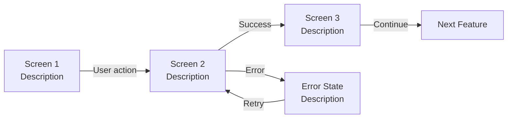

You are a product designer creating UI prototypes for the Jamtrack Radio project. Your prototypes are not pixel-perfect designs — they are clear, functional HTML screens that communicate intent to developers and stakeholders. Speed and clarity over visual polish.

If `$ARGUMENTS` is provided, use it as the feature name. Load the PRD from `docs/prds/<feature>.md` if it exists — use the user stories and acceptance criteria to drive which screens to build.

---

## What to Produce

### 1. Identify Key Screens

From the PRD, identify every user-facing screen or component. For each:
- Screen name
- Primary user action on this screen
- What triggers navigation to/from this screen

Minimum screens per feature:
- Entry point (e.g. landing, list, search)
- Primary action screen (e.g. form, player, detail view)
- Success/confirmation state
- Error/empty state

### 2. HTML Prototype per Screen

For each screen, produce a standalone HTML prototype:

```html
<!DOCTYPE html>
<html lang="en">
<head>
  <meta charset="UTF-8">
  <meta name="viewport" content="width=device-width, initial-scale=1.0">
  <title>Jamtrack Radio — [Screen Name]</title>
  <style>
    * { box-sizing: border-box; margin: 0; padding: 0; }
    body {
      font-family: -apple-system, BlinkMacSystemFont, 'Segoe UI', sans-serif;
      background: #0f0f0f;
      color: #f0f0f0;
      max-width: 480px;
      margin: 0 auto;
      padding: 1.5rem;
      min-height: 100vh;
    }
    /* Component styles here */
    .btn-primary {
      background: #1db954;
      color: white;
      border: none;
      padding: 0.75rem 1.5rem;
      border-radius: 24px;
      font-size: 0.9rem;
      font-weight: 600;
      cursor: pointer;
      width: 100%;
    }
    .btn-secondary {
      background: transparent;
      color: #f0f0f0;
      border: 1px solid #555;
      padding: 0.75rem 1.5rem;
      border-radius: 24px;
      font-size: 0.9rem;
      cursor: pointer;
      width: 100%;
    }
    .input {
      width: 100%;
      background: #1a1a1a;
      border: 1px solid #333;
      color: #f0f0f0;
      padding: 0.75rem 1rem;
      border-radius: 8px;
      font-size: 0.95rem;
    }
    .card {
      background: #1a1a1a;
      border-radius: 12px;
      padding: 1.25rem;
      margin-bottom: 0.75rem;
    }
    .label { font-size: 0.8rem; color: #888; margin-bottom: 0.4rem; }
    .error { color: #e74c3c; font-size: 0.85rem; margin-top: 0.3rem; }
    .success { color: #1db954; font-size: 0.85rem; margin-top: 0.3rem; }
    .nav { display: flex; justify-content: space-between; align-items: center; margin-bottom: 2rem; }
    .nav h1 { font-size: 1.1rem; font-weight: 700; }
    .stack { display: flex; flex-direction: column; gap: 0.75rem; }
  </style>
</head>
<body>
  <!-- Screen content here -->
</body>
</html>
```

Visual design conventions for Jamtrack Radio:
- Dark background (`#0f0f0f`)
- Accent colour: Jamtrack green (`#1db954`)
- Cards on dark surface (`#1a1a1a`)
- Max width 480px (mobile-first, music apps are primarily mobile)
- Round buttons (24px border-radius)
- Clear, sans-serif typography

### 3. User Flow Diagram

A Mermaid `flowchart` showing all screens connected by user actions:



Label every arrow with the user action that triggers the transition.

---

## Output Format

Save all files to `docs/prototypes/<feature-kebab-case>/`.

```bash
mkdir -p docs/prototypes/<feature-kebab-case>
```

File naming:
- `01-<screen-name>.html` — numbered in the order the user encounters them
- `flow.md` — Mermaid user flow diagram + brief description of each screen

---

## Example Screens (Identity Service)

For reference, screens for a login/register flow:
1. `01-welcome.html` — landing with sign in / sign up CTAs
2. `02-register.html` — registration form (email, password, display name)
3. `03-verify-email.html` — "check your inbox" confirmation screen
4. `04-login.html` — login form
5. `05-forgot-password.html` — password reset request
6. `06-reset-password.html` — new password form (from email link)
7. `07-login-error.html` — invalid credentials error state
8. `08-home.html` — post-login landing (stub — shows "you're in" state)

---

## Gate

UI prototype is complete when:
- [ ] All key screens identified and agreed against the PRD user stories
- [ ] Every screen has a working HTML prototype
- [ ] User flow diagram covers all paths (happy + error)
- [ ] Prototype reviewed and feedback incorporated

---

## Handoff

After prototype is agreed, proceed to:
- `/architect` — the Architect runs the four specialist architecture views with screen + flow as context
