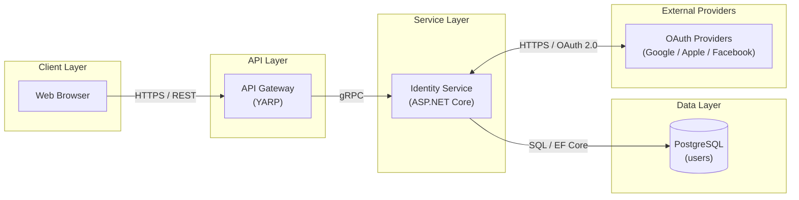
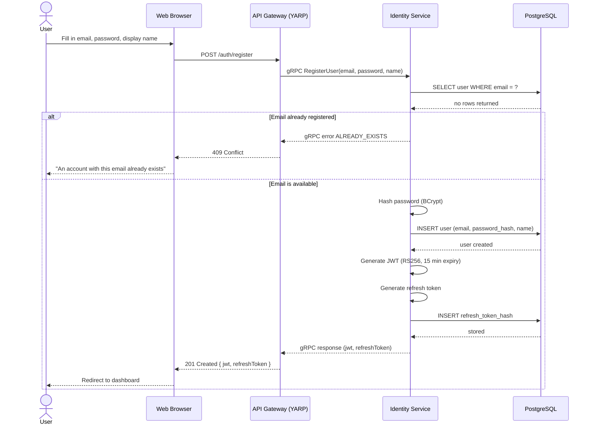
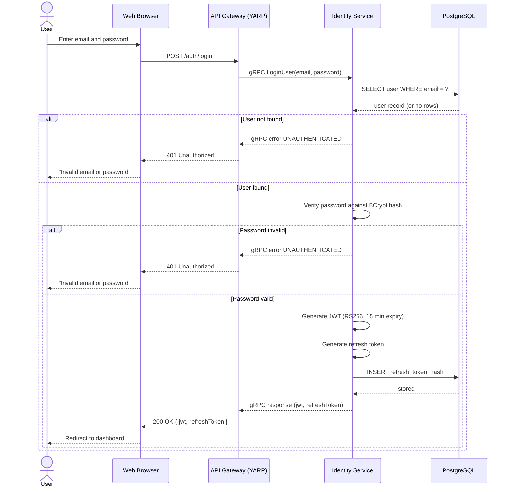
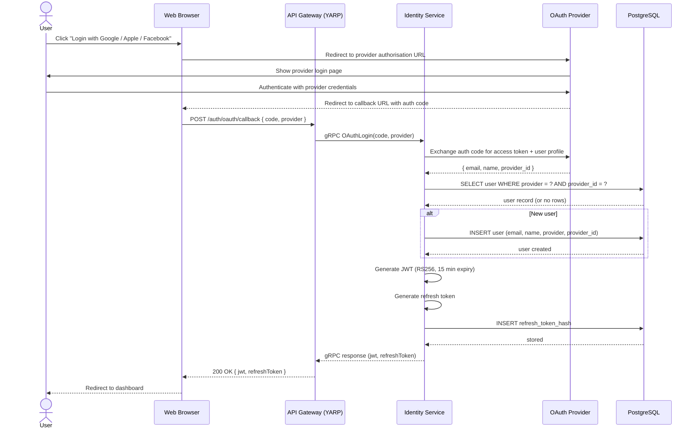

# Jamtrack Radio — Architecture

This document captures the architecture diagrams and interaction flows for the Jamtrack Radio platform. Each section covers a specific system, feature, or scenario. Diagrams are produced using Mermaid and render natively in GitHub.

---

## Create Account and Login

### Block Diagram

### Component Inventory

| # | Component | Role | Technology |
|---|-----------|------|------------|
| 1 | Web Browser | User-facing client, renders UI and manages tokens | Browser |
| 2 | API Gateway | Single entry point, routes external REST to internal gRPC | YARP (ASP.NET Core) |
| 3 | Identity Service | Handles registration, login, OAuth, JWT issuance | ASP.NET Core |
| 4 | PostgreSQL | Persists user records and refresh token hashes | PostgreSQL / EF Core |
| 5 | OAuth Providers | Third-party identity providers for social login | Google / Apple / Facebook |

### Interaction Flows

#### Scenario A: Create Account (Email)

**1. Registration Submission**
- 1.1. User fills in email, password, and display name and submits the registration form
- 1.2. Web Browser sends `POST /auth/register` to API Gateway over HTTPS

**2. Routing**
- 2.1. API Gateway validates the request structure and forwards to Identity Service via gRPC

**3. Account Creation**
- 3.1. Identity Service queries PostgreSQL to confirm the email is not already registered
- 3.2. Identity Service hashes the password using BCrypt
- 3.3. Identity Service persists the new user record to PostgreSQL

**4. Token Issuance**
- 4.1. Identity Service generates a JWT access token (RS256, 15-minute expiry)
- 4.2. Identity Service generates a refresh token and stores its hash in PostgreSQL
- 4.3. API Gateway returns the JWT and refresh token to the Web Browser

---

#### Scenario B: Login (Email)

**1. Credential Submission**
- 1.1. User enters email and password and submits the login form
- 1.2. Web Browser sends `POST /auth/login` to API Gateway over HTTPS

**2. Routing**
- 2.1. API Gateway forwards the request to Identity Service via gRPC

**3. Credential Validation**
- 3.1. Identity Service retrieves the user record from PostgreSQL by email
- 3.2. Identity Service verifies the submitted password against the stored BCrypt hash

**4. Token Issuance**
- 4.1. Identity Service generates a JWT access token (RS256, 15-minute expiry)
- 4.2. Identity Service generates a refresh token and stores its hash in PostgreSQL
- 4.3. API Gateway returns the JWT and refresh token to the Web Browser

---

#### Scenario C: Login (OAuth)

**1. OAuth Initiation**
- 1.1. User clicks "Login with Google / Apple / Facebook"
- 1.2. Web Browser redirects to the OAuth Provider's authorisation URL

**2. Provider Authentication**
- 2.1. User authenticates directly with the OAuth Provider
- 2.2. OAuth Provider redirects the browser back to the client with an authorisation code

**3. Code Exchange**
- 3.1. Web Browser sends the authorisation code to API Gateway via `POST /auth/oauth/callback`
- 3.2. API Gateway forwards to Identity Service via gRPC
- 3.3. Identity Service exchanges the code with the OAuth Provider for the user's profile (email, name, provider ID)

**4. Account Lookup / Creation**
- 4.1. Identity Service queries PostgreSQL for an existing user matching the provider and provider ID
- 4.2. If no match is found, Identity Service creates a new user record in PostgreSQL

**5. Token Issuance**
- 5.1. Identity Service generates a JWT access token (RS256, 15-minute expiry)
- 5.2. Identity Service generates a refresh token and stores its hash in PostgreSQL
- 5.3. API Gateway returns the JWT and refresh token to the Web Browser

### Key Design Decisions

- **gRPC for internal routing** — API Gateway to Identity Service uses gRPC for strong typing and performance; the external interface remains REST so any client can consume it
- **JWT with RS256** — asymmetric signing means other services can verify tokens using the public key without needing the private key
- **Refresh tokens hashed in PostgreSQL** — raw refresh tokens are never stored; only hashes, so a database breach doesn't expose valid tokens
- **OAuth tokens never persisted** — authorisation codes and provider access tokens are exchanged immediately and discarded; only the normalised user profile is retained
- **YARP as API Gateway** — lightweight, runs in-process as ASP.NET Core middleware, no separate infrastructure needed for local dev

---

## Create Account Flow

---

## Login Flow

### Email Login

### OAuth Login (Google / Apple / Facebook)

