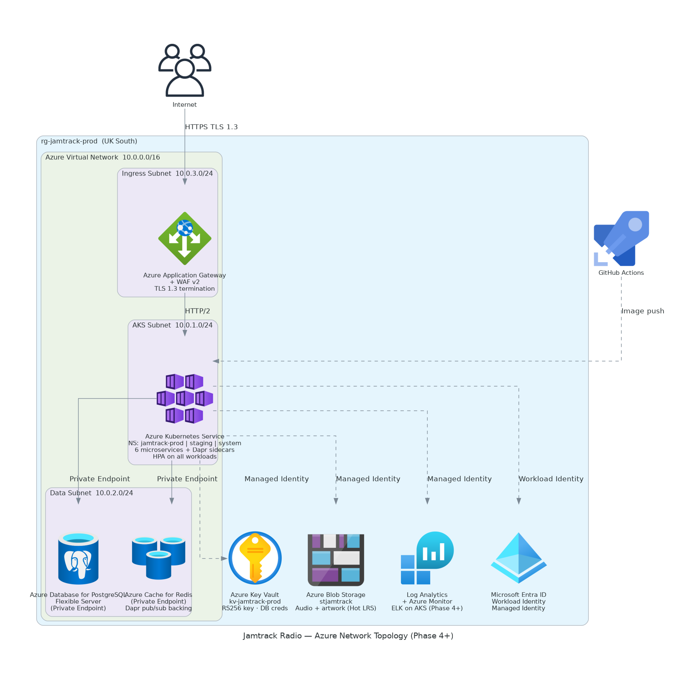
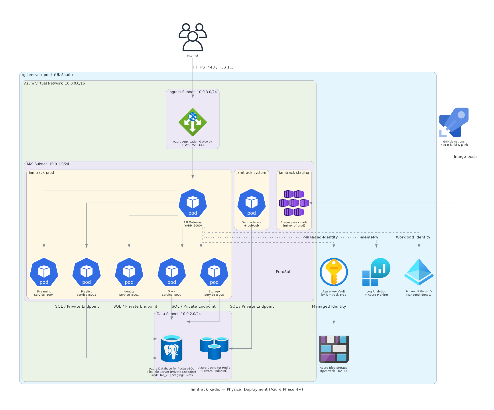

# Cloud Architecture: Jamtrack Radio

**Date**: 2026-03-22
**Author**: Kintsugi (Cloud Architect)
**Status**: Accepted
**Skill**: `/cloud-architect jamtrack-radio` — DISCOVERY Step 5b
**Inputs**: `software-arch.md` (6 services defined), `jamtrack-radio-requirements.md` (budget: £50–100/month Azure from Phase 4)

---

## 1. Phase-Aware Infrastructure Overview

| Component | Phase 2 (local) | Phase 3 (local K8s) | Phase 4+ (Azure) |
|-----------|-----------------|---------------------|------------------|
| Compute | Docker Compose | Rancher Desktop K8s | Azure Kubernetes Service (AKS) |
| Container registry | Local Docker | Local Docker | Azure Container Registry (ACR) |
| Database | Docker PostgreSQL 16 | Docker PostgreSQL 16 | Azure Database for PostgreSQL Flexible Server |
| Secrets | `.env.local` (gitignored) | K8s Secrets | Azure Key Vault |
| Ingress | `localhost` ports | Traefik (Rancher Desktop) | Azure Application Gateway + WAF v2 |
| DNS | — | — | Azure DNS |
| Monitoring | stdout logs | stdout logs | ELK on AKS + ClickHouse |
| Blob storage | Local filesystem mock | Azure Blob (remote) or local MinIO | Azure Blob Storage (Hot tier) |
| Service mesh / sidecar | Dapr (local) | Dapr (K8s mode) | Dapr (K8s mode on AKS) |
| Pub/sub broker | Redis (Docker) | Redis (Docker/K8s) | Azure Service Bus (Standard) |
| Secrets vault | `.env.local` | K8s Secrets | Azure Key Vault |

---

## 2. Azure Network Topology Diagram (Phase 4+)

Hub-spoke VNet topology. Internet traffic enters via Application Gateway + WAF v2, routes through the AKS subnet, and connects to the data tier via private endpoints. Azure services outside the VNet authenticate via Managed Identity.



> Source: [`diagrams/cloud-network-topology.png`](diagrams/cloud-network-topology.png) — generated by `cloud-network-topology.py` (Python Diagrams library)

---

## 3. AKS Node Pool Sizing

| Environment | Node pool | Node SKU | Min | Max | Rationale |
|-------------|-----------|----------|-----|-----|-----------|
| Staging | `system` | Standard_B2s | 1 | 2 | System pods only — burstable, cost-optimised |
| Staging | `user` | Standard_B4ms | 1 | 3 | App workloads — burstable is sufficient for staging |
| Production | `system` | Standard_D2s_v5 | 2 | 3 | HA system workloads |
| Production | `user` | Standard_D4s_v5 | 2 | 10 | App workloads — HPA-controlled auto-scale |

**Namespace strategy**:
- `jamtrack-prod` — production workloads
- `jamtrack-staging` — staging workloads
- `jamtrack-system` — shared infrastructure (Dapr control plane, Redis, monitoring agents)

Each namespace has a `ResourceQuota` to cap CPU and memory, and a default-deny `NetworkPolicy`.

---

## 4. Service-to-Infrastructure Mapping

| Service | Replicas (prod baseline) | CPU request/limit | Memory request/limit | HPA target |
|---------|-------------------------|-------------------|----------------------|------------|
| API Gateway (YARP) | 2 | 100m / 500m | 128Mi / 256Mi | CPU 70% |
| Identity Service | 2 | 100m / 300m | 128Mi / 256Mi | CPU 70% |
| Track Service | 2 | 100m / 300m | 128Mi / 256Mi | CPU 70% |
| Playlist Service | 1 | 50m / 200m | 64Mi / 128Mi | CPU 70% |
| Streaming Service | 2 | 200m / 1000m | 256Mi / 512Mi | CPU 60% (bandwidth-intensive) |
| Storage Service | 1 | 50m / 200m | 64Mi / 128Mi | CPU 70% |
| Dapr sidecar (each) | — | 10m / 100m | 32Mi / 64Mi | — |

---

## 5. Cost Estimate Table

### Dev / Staging (monthly, Phase 4+)

| Resource | SKU / Config | Monthly cost |
|----------|-------------|-------------|
| AKS nodes — staging (2× Standard_B4ms) | Burstable | ~£100 |
| PostgreSQL Flexible Server — staging | Burstable B_Standard_B2ms | ~£35 |
| Azure Service Bus — Standard | Per operation | ~£8 |
| Azure Container Registry — Basic | 10 GB included | ~£4.50 |
| Azure Key Vault — Standard | Key operations | ~£1 |
| Azure Blob Storage (audio) — Hot LRS | 100 GB | ~£2 |
| Log Analytics — staging (2 GB/day, 30-day retention) | Pay-per-GB | ~£46 |
| **Staging total** | | **~£197/month** |

> **Note**: This is below the £326 in the skill template because staging node pools are burstable B-series (lower cost). Apply the 30% buffer from the financial lens: **~£256/month worst case**.

### Production — Baseline (monthly, Phase 4+)

| Resource | SKU / Config | Monthly cost |
|----------|-------------|-------------|
| AKS nodes — prod (2× Standard_D4s_v5) | General purpose | ~£307 |
| PostgreSQL Flexible Server — prod | General Purpose D4s | ~£277 |
| Azure Application Gateway + WAF v2 | WAF_v2 | ~£183 |
| Azure Service Bus — Standard | Per operation | ~£8 |
| Azure Container Registry — Basic | | ~£4.50 |
| Azure Key Vault | | ~£1 |
| Azure Blob Storage (audio) — Hot LRS | 500 GB + egress | ~£15 |
| Azure DNS | Hosted zone + queries | ~£1 |
| Log Analytics — prod (5 GB/day, 30-day hot) | | ~£345 |
| **Production baseline** | | **~£1,142/month** |

**Production at 2× load**: +1 AKS node (D4s_v5) = ~£1,295/month
**Production at 10× load**: +4 AKS nodes = ~£1,700/month

---

## 6. Total Cost of Ownership (TCO)

| Scenario | Monthly | Annual | Notes |
|----------|---------|--------|-------|
| Development (Phase 2–3) | £0 | £0 | Local only |
| Staging (Phase 4+) | £197–256 | £2,364–3,072 | Always-on |
| Production baseline (Phase 4+) | £1,142 | £13,704 | |
| Production at 2× | £1,295 | £15,540 | |
| Production at 10× | £1,700 | £20,400 | |
| **Phase 4 Year 1 total** | | **~£16,068–17,000** | Staging + prod baseline |

> **Budget check**: The personal budget constraint is £50–100/month (requirements §3). This architecture significantly exceeds it at full Phase 4 deployment. **Mitigation**: Phase 4 development runs on staging only (£197–256/month with auto-shutdown — see §7). Production-grade sizing applies only if the platform is used for live streaming.

---

## 7. Cost Optimisation Recommendations

| Recommendation | Saving | Effort | Priority |
|----------------|--------|--------|----------|
| Auto-shutdown staging 19:00–08:00 | ~£100/month (staging) | Low | High |
| Use Azure Spot instances for staging node pool | ~£50–80/month | Medium | Medium |
| 1-year reserved instances for production compute | ~£120/month | Low | Medium (Phase 4+) |
| Burstable B-series for PostgreSQL staging | Already applied | — | Done |
| Set Log Analytics retention to 30 days hot / archive cold | ~£100/month at prod scale | Low | High |
| Use Azure Blob Cool tier for tracks not accessed in 30 days | ~£5/month | Low | Phase 5 |
| Budget alert at 80% of expected spend | £0 | Low | High — do this on day one |

---

## 8. Helm Chart Structure

```
helm/
  api-gateway/
    Chart.yaml
    values.yaml
    values.staging.yaml
    values.prod.yaml
    templates/
      deployment.yaml
      service.yaml
      configmap.yaml
      hpa.yaml
      pdb.yaml
  identity-service/
    ...  (same structure)
  track-service/
  playlist-service/
  streaming-service/
  storage-service/
```

All charts share a common pattern. `values.yaml` holds defaults; environment-specific overrides in `values.staging.yaml` and `values.prod.yaml`. Image tags reference SHA digests in production (never `latest`).

---

## 9. Physical Deployment Diagram (Azure — Phase 4+)

Full Azure resource group view using official Azure service names and Azure Architecture Center icon conventions.



> Source: [`diagrams/physical-deployment.png`](diagrams/physical-deployment.png) — generated by `physical-deployment.py` (Python Diagrams library)
