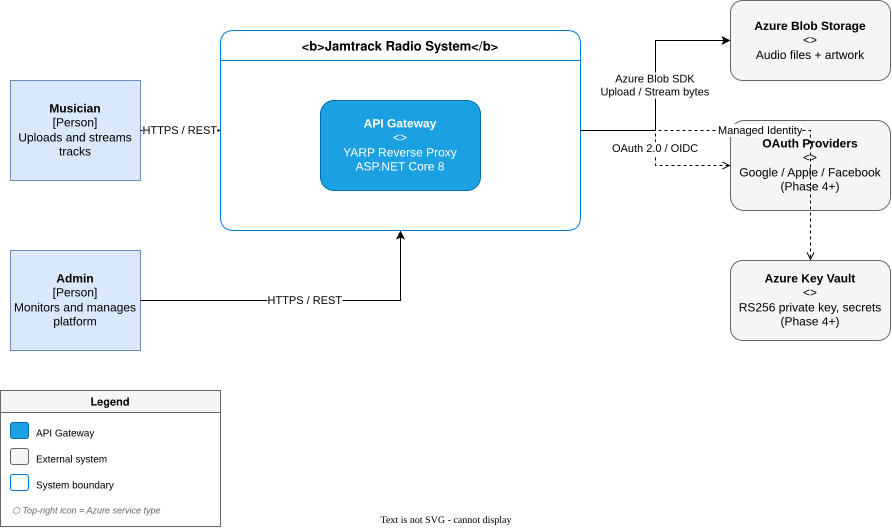
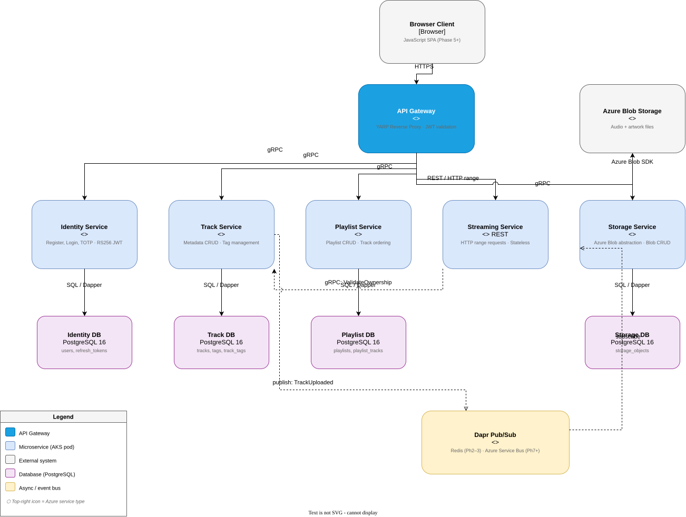
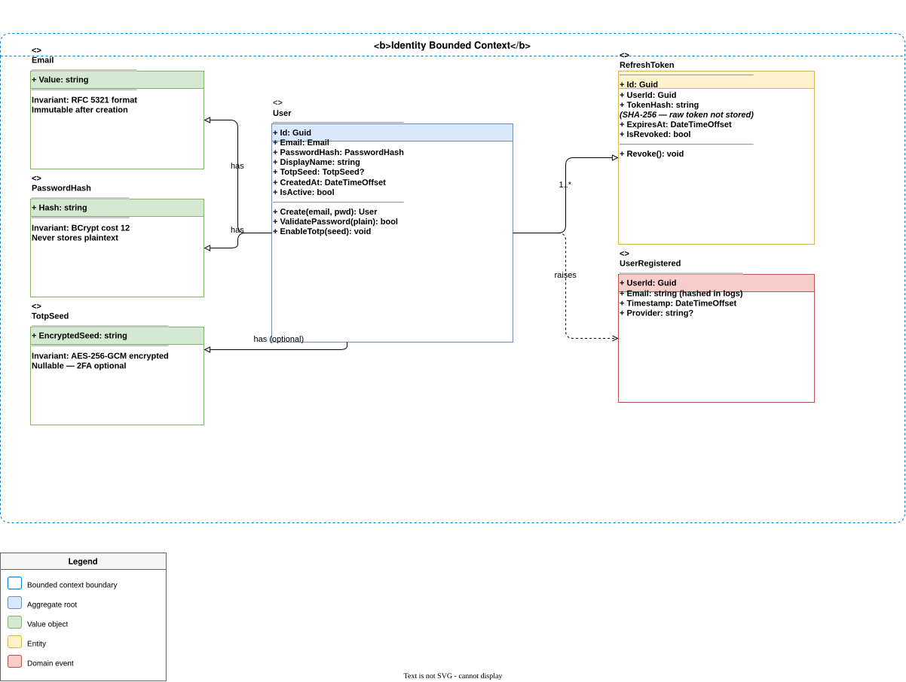

# Software Architecture: Jamtrack Radio

**Date**: 2026-03-22
**Author**: Kintsugi (Architect)
**Status**: Accepted
**Skill**: `/software-architect jamtrack-radio` — DISCOVERY Step 5a

---

## 1. System Context Diagram (C4 Level 1)

Shows the system boundary and its relationships with external actors and systems.

> _Edit this diagram: open [`context.drawio`](diagrams/context.drawio) in VS Code with the [Draw.io Integration](https://marketplace.visualstudio.com/items?itemName=hediet.vscode-drawio) extension, then re-export as `.drawio.svg`._

---

## 2. Container Interaction Diagram (C4 Level 2)

Shows each microservice, its technology, communication protocol, and data ownership. Synchronous gRPC calls are solid arrows; the async Dapr event bus uses dashed arrows through a queue shape annotated `eventually consistent`.

> _Edit this diagram: open [`containers.drawio`](diagrams/containers.drawio) in VS Code with the [Draw.io Integration](https://marketplace.visualstudio.com/items?itemName=hediet.vscode-drawio) extension, then re-export as `.drawio.svg`._

### Service Port Map

| Service | Protocol | Port (local) | Notes |
|---------|----------|-------------|-------|
| API Gateway | REST / HTTPS | 5000 | YARP reverse proxy |
| Identity Service | gRPC | 5001 | |
| Track Service | gRPC | 5002 | |
| Playlist Service | gRPC | 5003 | |
| Streaming Service | REST | 5004 | HTTP range requests |
| Storage Service | gRPC | 5005 | Azure Blob / S3 abstraction |

---

## 3. Domain Model

### Bounded Context: Identity

> _Edit this diagram: open [`domain-identity.drawio`](diagrams/domain-identity.drawio) in VS Code with the [Draw.io Integration](https://marketplace.visualstudio.com/items?itemName=hediet.vscode-drawio) extension, then re-export as `.drawio.svg`._

| Element | Type | Key properties / invariants |
|---------|------|----------------------------|
| `User` | Aggregate root | `Id (Guid)`, `Email (VO)`, `PasswordHash (VO)`, `DisplayName`, `CreatedAt`; email must be unique; password min 8 chars |
| `Email` | Value object | `Value (string)`; must match RFC 5321 format; immutable after creation |
| `PasswordHash` | Value object | `Hash (string)`; BCrypt cost 12; never stores plain text |
| `TotpSeed` | Value object | `EncryptedSeed (string)`; AES-256 encrypted at rest; nullable (2FA optional) |
| `RefreshToken` | Entity | `Id`, `UserId`, `TokenHash`, `ExpiresAt`, `IsRevoked`; stores SHA-256 hash only |
| `UserRegistered` | Domain event | Raised when `User.Create()` succeeds; carries `UserId`, `Email` |
| `UserLoggedIn` | Domain event | Raised on successful authentication; carries `UserId`, `timestamp`, `ip` |

---

### Bounded Context: Track Catalogue

| Element | Type | Key properties / invariants |
|---------|------|----------------------------|
| `Track` | Aggregate root | `Id`, `UserId`, `Title`, `Artist`, `Genre`, `Bpm`, `MusicalKey`, `Duration`, `StorageRef`, `ArtworkRef`, `CreatedAt`; belongs to exactly one user; title required |
| `Bpm` | Value object | `Value (int)`; must be 1–300 |
| `MusicalKey` | Value object | `Value (string)`; validated against 24 major/minor keys |
| `StorageRef` | Value object | `BlobPath (string)`; set by Storage Service after upload completes |
| `Tag` | Entity | `Id`, `Name`, `UserId`; scoped per user; name unique per user |
| `TrackTag` | Association | `TrackId`, `TagId`; many-to-many |
| `TrackUploaded` | Domain event | Raised when `Track.Create()` completes with a valid `StorageRef`; triggers Storage Service processing |
| `TrackDeleted` | Domain event | Raised on `Track.Delete()`; triggers Storage Service blob removal |

---

### Bounded Context: Playlist

| Element | Type | Key properties / invariants |
|---------|------|----------------------------|
| `Playlist` | Aggregate root | `Id`, `UserId`, `Name`, `CreatedAt`; user can have unlimited playlists; name required, unique per user |
| `PlaylistTrack` | Value object within aggregate | `TrackId`, `Position (int)`; position is 1-based; no duplicate `TrackId` within a playlist |

---

### Bounded Context: Audio Delivery (Streaming)

Stateless — no domain entities. Receives a `trackId` + JWT, validates ownership via gRPC call to Track Service, then streams the blob via HTTP range requests. No persistence.

---

### Bounded Context: Storage

| Element | Type | Key properties / invariants |
|---------|------|----------------------------|
| `StorageObject` | Entity | `Id`, `BlobPath`, `ContentType`, `SizeBytes`, `OwnerId`, `CreatedAt` |
| `PresignedUrl` | Value object | `Url`, `ExpiresAt`; short-lived (15 min) URL for direct blob read; never stored |

---

## 4. Component Responsibility Matrix

| Component | Bounded Context | Responsibility | Layer | Owns DB tables |
|-----------|----------------|----------------|-------|----------------|
| `User` | Identity | User invariants, password validation | Domain | — |
| `IUserRepository` | Identity | Persistence contract | Application | — |
| `RegisterUserCommand` | Identity | Register use case + BCrypt hash | Application | — |
| `LoginCommand` | Identity | Credential validation, JWT issuance | Application | — |
| `RefreshTokenCommand` | Identity | Token rotation, revocation | Application | — |
| `TotpService` | Identity | TOTP seed generation, code validation, AES-256 encryption | Application | — |
| `UserRepository` | Identity | Dapper `users` + `refresh_tokens` | Infrastructure | `users`, `refresh_tokens` |
| `IdentityGrpcService` | Identity | gRPC endpoints: Register, Login, Refresh, EnableTotp | Api | — |
| `Track` | Track Catalogue | Track invariants, metadata validation | Domain | — |
| `ITrackRepository` | Track Catalogue | Persistence contract | Application | — |
| `UploadTrackCommand` | Track Catalogue | Create track record, publish `TrackUploaded` | Application | — |
| `TrackRepository` | Track Catalogue | Dapper `tracks`, `tags`, `track_tags` | Infrastructure | `tracks`, `tags`, `track_tags` |
| `TrackGrpcService` | Track Catalogue | gRPC endpoints: Upload, GetById, List, Delete, ManageTags | Api | — |
| `Playlist` | Playlist | Playlist invariants, track ordering | Domain | — |
| `IPlaylistRepository` | Playlist | Persistence contract | Application | — |
| `PlaylistRepository` | Playlist | Dapper `playlists`, `playlist_tracks` | Infrastructure | `playlists`, `playlist_tracks` |
| `PlaylistGrpcService` | Playlist | gRPC: Create, Rename, Delete, AddTrack, RemoveTrack, Reorder | Api | — |
| `StreamController` | Audio Delivery | HTTP range streaming, ownership validation | Api | — |
| `IStorageService` | Storage | Blob CRUD contract | Application | — |
| `AzureBlobStorageService` | Storage | Azure Blob SDK implementation | Infrastructure | `storage_objects` |
| `StorageGrpcService` | Storage | gRPC: Store, Delete, GetPresignedUrl | Api | — |
| `ApiGateway` | — | YARP route config, JWT validation middleware | — | — |

---

## 5. Service Boundary Decisions

**Why is Identity separate from Track?**
- Different rate of change: auth protocols (OAuth, TOTP) evolve independently of track metadata
- Different security posture: Identity handles secrets (signing keys, TOTP seeds), Track does not
- Different scalability: track listing is read-heavy; login is infrequent
- Standard separation: authentication is a classic cross-cutting concern that every service consumes but none should own

**Why is Streaming separate from Track?**
- Different protocol: Streaming uses HTTP range requests (REST); Track uses gRPC
- Different scalability: streaming is bandwidth-intensive; metadata CRUD is request-count-intensive
- Different infrastructure: streaming benefits from a CDN or blob pre-signed URL in Phase 4+; metadata does not
- Stateless: Streaming has no domain state — no repository, no DB — it is a pure API adapter

**Why is Storage separate from Streaming?**
- Different cloud provider abstraction: Storage Service owns the Azure Blob / S3 switch (ADR-005 deferred)
- Separation allows Track Service to publish `TrackUploaded` event and Storage to handle post-processing (transcoding, thumbnail generation) asynchronously without coupling to Track
- Single responsibility: Track knows what was uploaded; Storage knows where it lives

**Why is Playlist separate from Track?**
- Different data ownership: Playlist owns `playlist_tracks` ordering; Track Service owns track metadata. No cross-service table reads permitted.
- Different rate of change: playlist UI interactions (reorder, add/remove) are frequent and independent of track metadata edits

**Why API Gateway rather than service-to-service client calls?**
- Single HTTPS ingress point; all external JWT validation happens here
- YARP is a lightweight reverse proxy native to ASP.NET Core — no external dependency, no Ocelot/Kong overhead at Phase 2

---

## 6. Build vs. Buy Analysis

| Component | Build | Buy / OSS | Decision | Rationale | Cost |
|-----------|-------|-----------|----------|-----------|------|
| Auth tokens | Custom | `Microsoft.AspNetCore.Authentication.JwtBearer` | Buy | Industry standard; well-audited | £0 |
| TOTP | Custom | `Otp.NET` NuGet | Buy | RFC 6238 implementation; not core competency | £0 |
| gRPC framework | Custom | `Grpc.AspNetCore` | Buy | Google-maintained; native .NET support | £0 |
| API Gateway | Custom | YARP (Microsoft) | Buy | ASP.NET Core native, no external service | £0 |
| Service invocation + pub/sub | Custom | Dapr | Buy | Production-grade sidecar pattern; avoids hand-rolled retry/circuit breaker logic | £0 (self-hosted) |
| Migrations | Custom | FluentMigrator | Buy | Fine-grained SQL control; mandatory per constraints | £0 |
| ORM | Dapper | EF Core | Dapper (required) | Mandatory per project constraints; SQL-first | £0 |
| OAuth providers | Custom | Google / Apple / Facebook OAuth SDKs | Buy | Not a differentiating concern | £0 (Phase 4) |
| Blob storage | Custom | Azure Blob SDK / AWS S3 SDK | Buy | Managed service; cost-efficient | ~£2/month |
| Message broker | Custom | Dapr pub/sub (Redis locally, Azure Service Bus Phase 4) | Buy | Dapr abstracts provider; no vendor lock-in | £0 (local) |

---

## 7. Architecture Decision Records

See `docs/decisions/` for the full ADR files. Summary:

| ADR | Title | Status |
|-----|-------|--------|
| [ADR-001](../../decisions/ADR-001-grpc-internal-communication.md) | gRPC for all internal service-to-service communication | Accepted |
| [ADR-002](../../decisions/ADR-002-rs256-jwt-authentication.md) | RS256 JWT for authentication | Accepted |
| [ADR-003](../../decisions/ADR-003-dapper-data-access.md) | Dapper over EF Core for data access | Accepted |
| [ADR-004](../../decisions/ADR-004-yarp-api-gateway.md) | YARP as the API Gateway | Accepted |
| [ADR-005](../../decisions/ADR-005-dapr-service-invocation.md) | Dapr for service invocation and pub/sub | Accepted |
