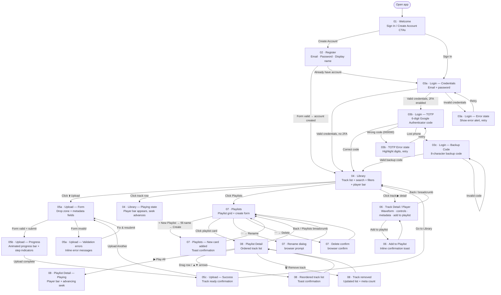

# Jamtrack Radio — Product-Level User Flow

> **Product Discovery Step 4b** · Generated 2026-03-21 · Covers all product-level screens

---

## Screen Inventory

| # | File | Screen | Primary action | Personas |
|---|------|--------|---------------|----------|
| 01 | `01-welcome.html` | Welcome / Landing | Choose Sign In or Create Account | All |
| 02 | `02-register.html` | Registration | Create account with email + password | New user |
| 03 | `03-login.html` | Login | Sign in (3 states: credentials → 2FA → backup code) | Returning user |
| 04 | `04-library.html` | Library | Browse, search, filter, play tracks | Musician |
| 05 | `05-upload-track.html` | Upload Track | Upload file + enter metadata (3 states: form → progress → success) | Musician |
| 06 | `06-player.html` | Track Detail / Player | Full player with waveform, track info, add to playlist | Musician |
| 07 | `07-playlists.html` | Playlists | List, create, rename, delete playlists | Musician |
| 08 | `08-playlist-detail.html` | Playlist Detail | View tracks, play all, reorder (drag or arrows), remove tracks | Musician |

---

## User Flow Diagram

---

## Happy Path Summary

1. New user: `Welcome → Register → Library`
2. Returning user (no 2FA): `Welcome → Login → Library`
3. Returning user (2FA): `Welcome → Login → TOTP code → Library`
4. Upload a track: `Library → Upload (drop file + metadata) → Progress → Success → Library`
5. Play a track: `Library → click row → Player bar appears → seek advances`
6. View track detail: `Library → Track detail/Player → waveform plays → Add to playlist`
7. Manage playlists: `Library → Playlists → New Playlist → Playlist Detail → Reorder / Play`

---

## Error Paths

| Screen | Error | Response |
|--------|-------|----------|
| Register | Empty field / invalid email / passwords don't match | Inline validation error per field |
| Login | Empty field | Inline field error |
| Login | Wrong password | Alert banner, retry |
| Login | Wrong TOTP code (000000) | Digits highlighted, retry |
| Login | Invalid backup code (INVALID1) | Error alert, retry |
| Upload | Empty title | Inline field error |
| Upload | BPM out of range | Inline field error |

---

## Prototype Notes

- **Navigation**: All links use `<a href="...">` with relative paths — open `01-welcome.html` in a browser and every button navigates correctly.
- **2FA demo**: In `03-login.html`, type any email containing `2fa` (e.g. `me@2fa.com`) to trigger the TOTP step. Enter `000000` to see the error state; any other 6 digits proceeds to the library.
- **Player**: In `04-library.html`, clicking a track activates the sticky bottom player bar with live seek progress. `06-player.html` auto-starts playback with a generated waveform.
- **Upload**: Drag any file onto the drop zone or click browse. Submitting runs a simulated progress animation → success state.
- **Playlist reorder**: In `08-playlist-detail.html`, use the ▲/▼ arrow buttons or drag rows to reorder.
